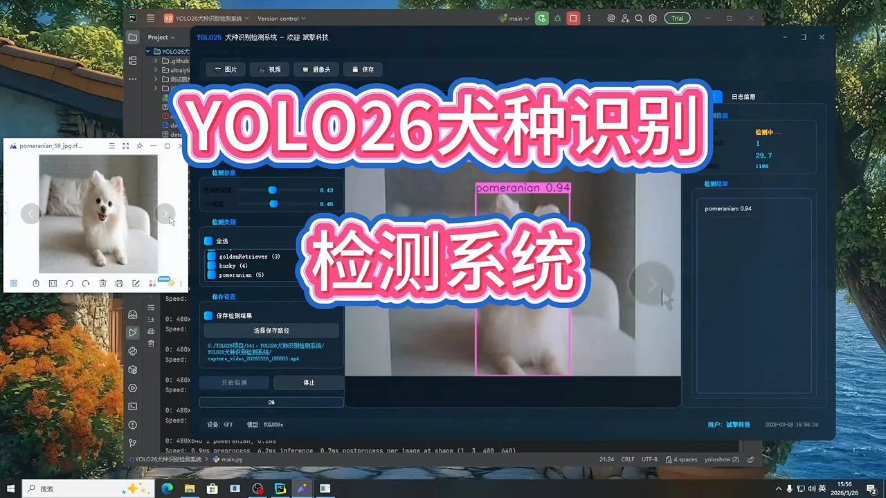
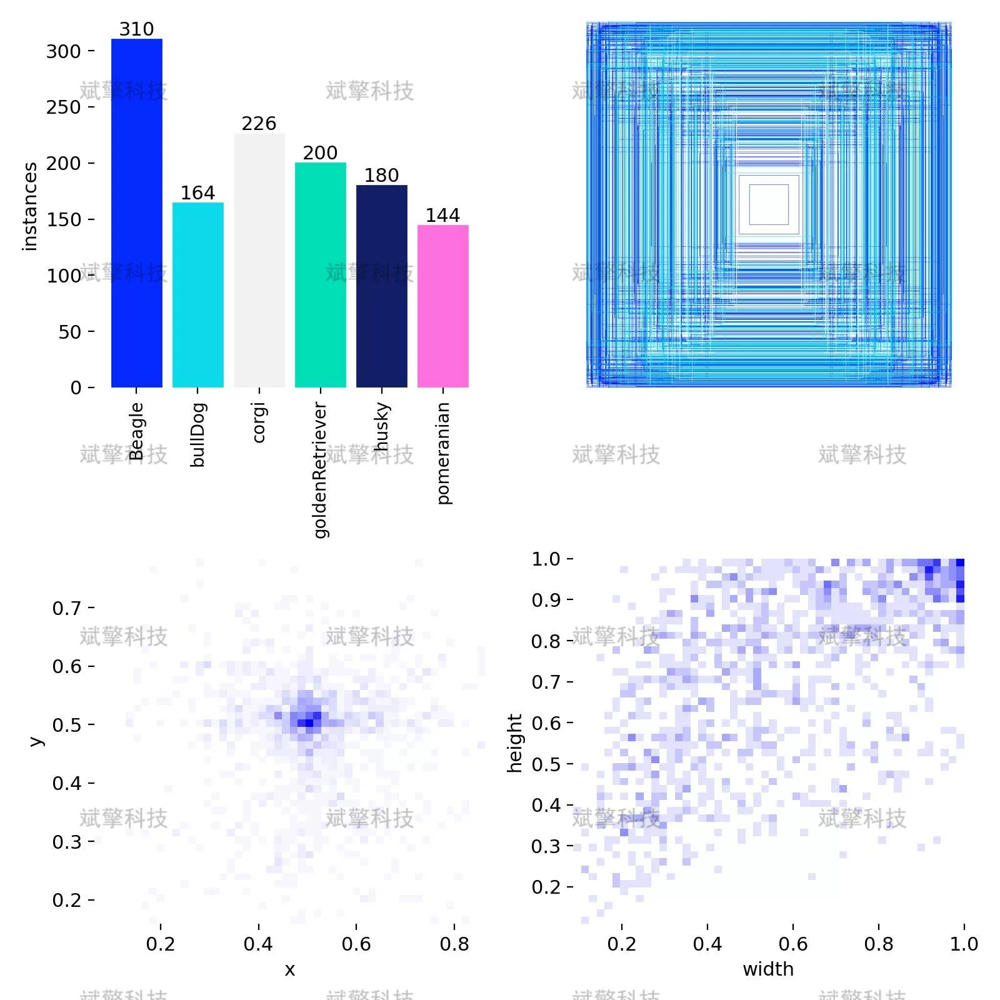
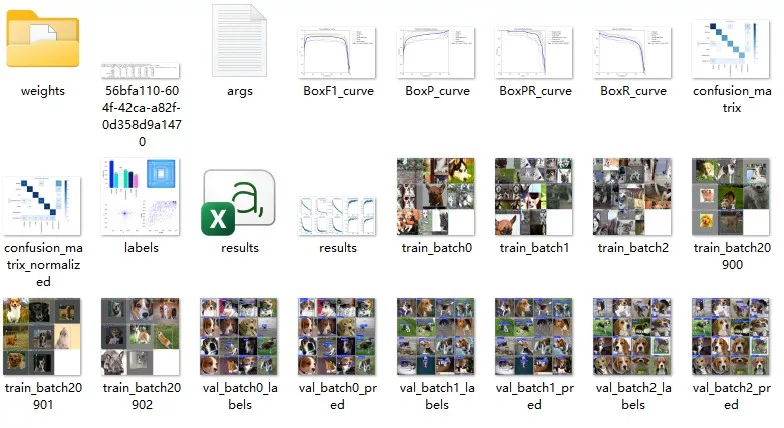
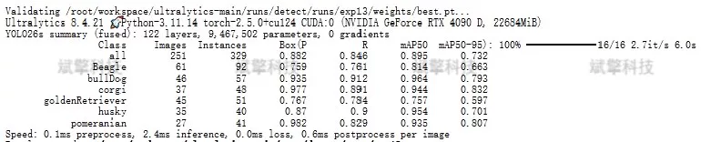
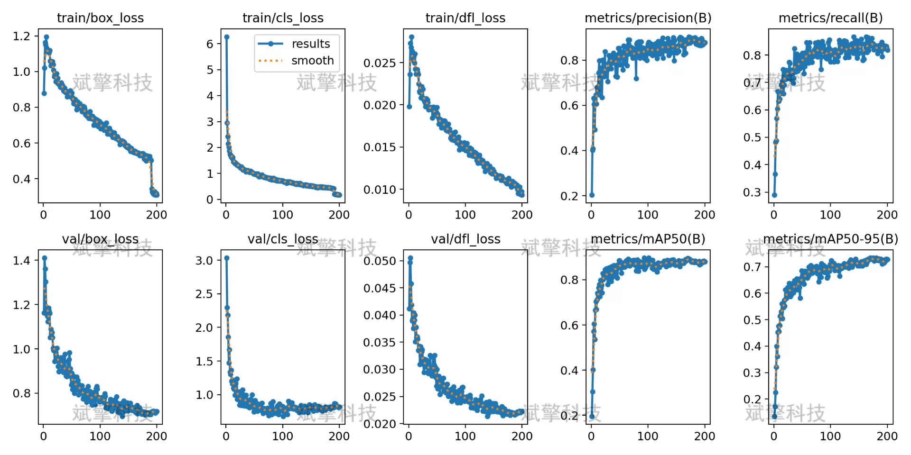
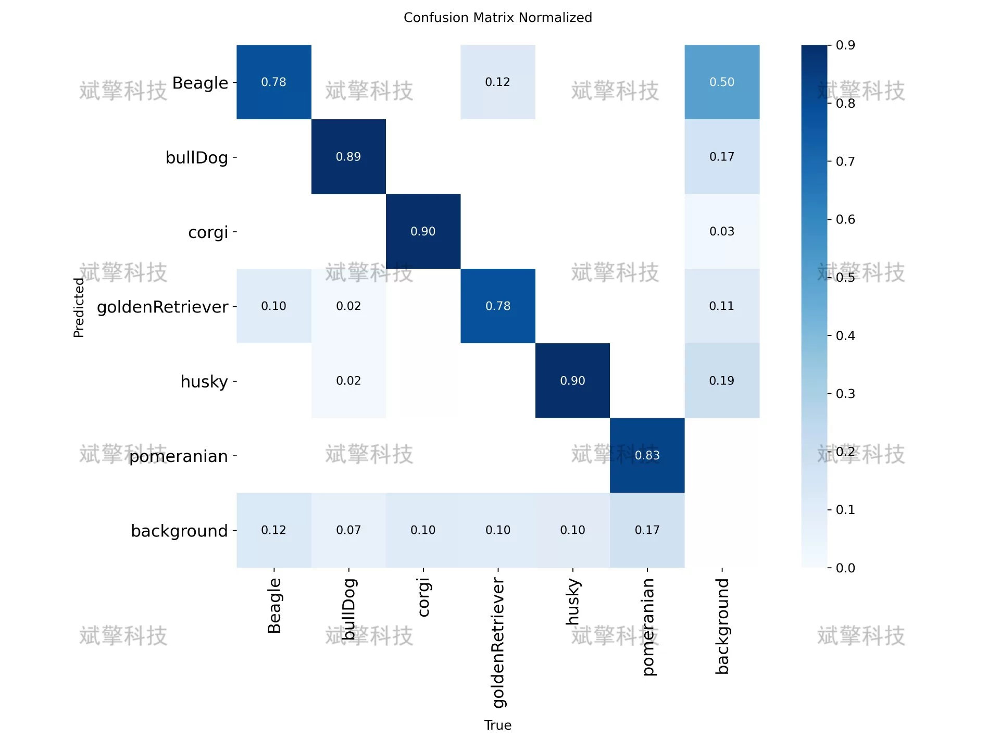
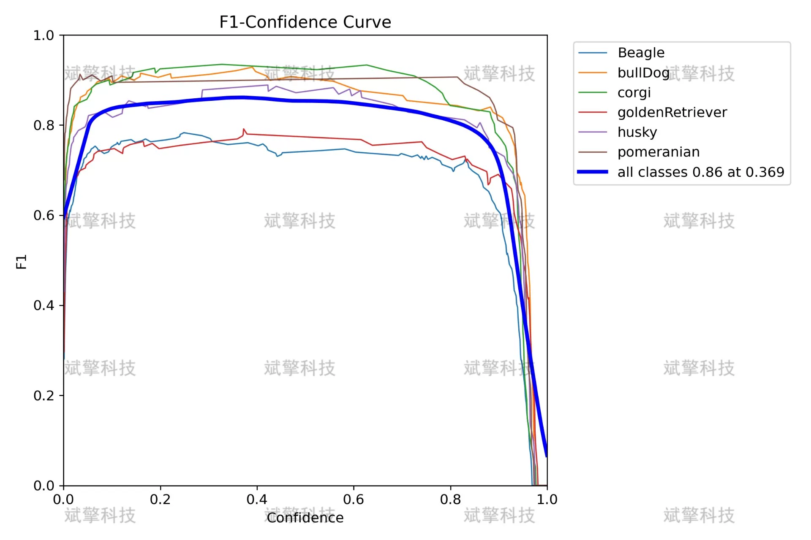
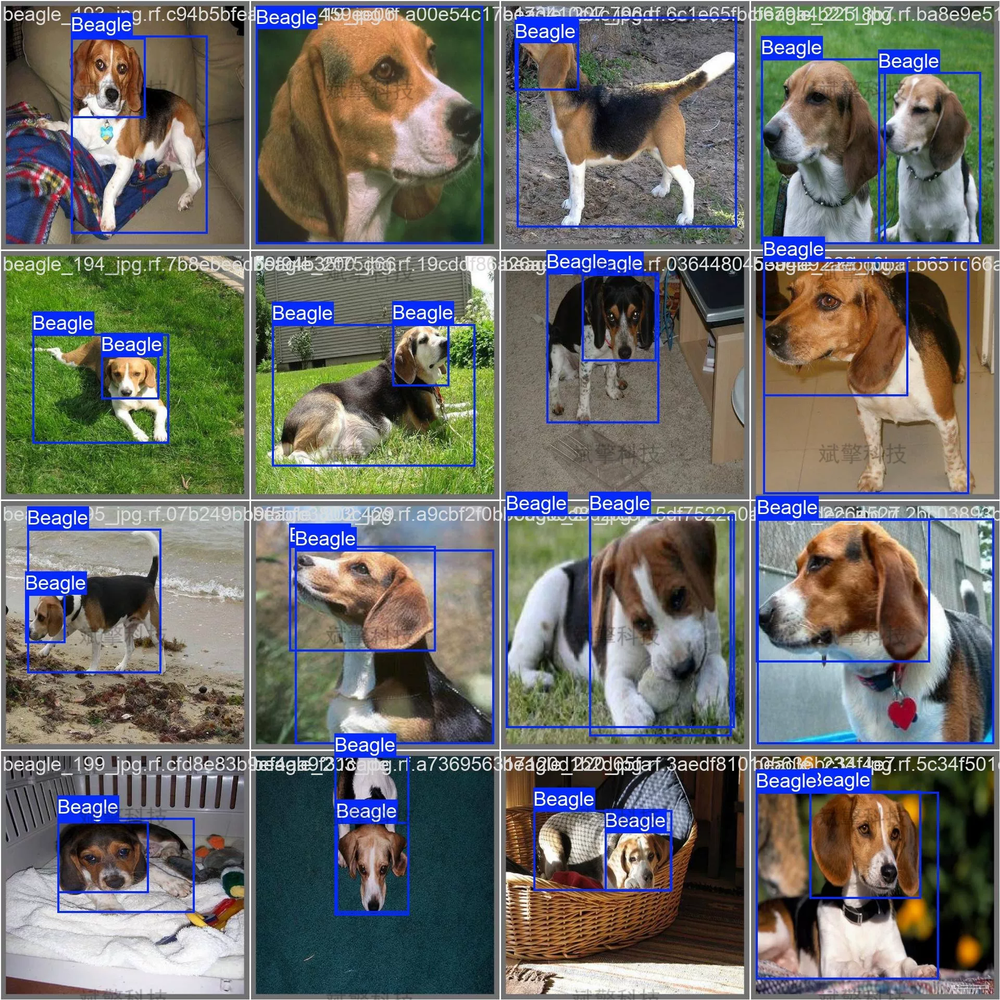
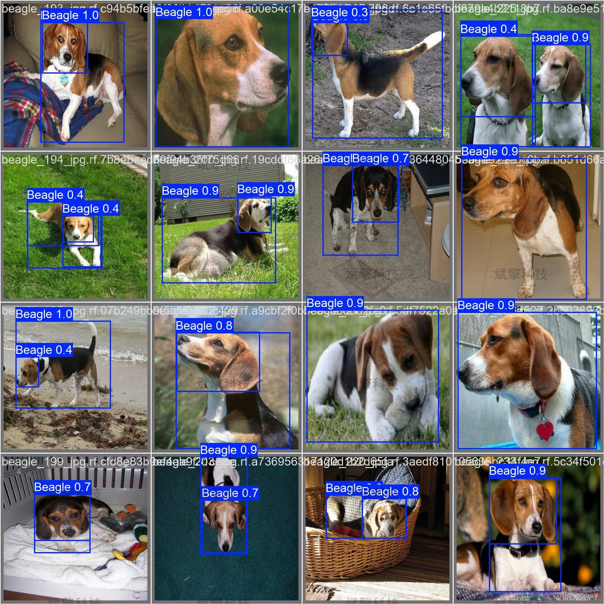

# YOLOv2 Dog Breed Identification System | Source Code + Dataset

## Body

YOLOv2 6-Class Dog Detection System | Source Code + Dataset Based on YOLOv2: mAP50 reached 0.895, inference speed 2.4ms/image (Project source code + dataset + model weights + UI interface + Python + Deep learning + remote environment deployment)

This system is based on the YOLO26 object detection algorithm and has built an intelligent recognition detection model for six common dog breeds. The research covers six dog breeds, namely Beagle, bulldog, corgi, golden retriever, husky, and pomeranian. The total dataset size is 1257 labeled images, including 880 training images, 251 validation images, and 126 test images. After complete training, the model achieved excellent performance with mAP50=0.895 and mAP50-95=0.732 on the validation set, with an accuracy of 0.882 and a recall rate of 0.846. Among the categories, the bulldog performed best (mAP50=0.964), while the golden retriever was relatively weak (mAP50=0.757). The model's inference speed is 2.4ms/image, meeting the requirements for real-time detection. The research results indicate that YOLO26 has good application potential in fine-grained identification tasks for dog breeds, providing feasible technical solutions for scenarios such as pet intelligence management and animal protection.

Dataset contains 6 dog breeds:

Free remote installation appointments. Unsuccessful, full refund.
Purchase includes the following resources (auto-unlocked by Baidu Pan)
YOLO recognition detection project complete source code
YOLO format datasets
Training code + UI interface code
Trained model + results images
Software installation package
Add WeChat to make a remote installation appointment (shown automatically after purchase) —— Unsuccessful, full refund

⚙️ Core Function Modules
Detection Capabilities
    Image Detection: Upon upload, returns detection boxes + category information.
    Video Detection: Supports video files, analyzes frames accurately in real-time.
    Camera Real-Time Detection: Attaches USB cameras to achieve dynamic monitoring.

️ Interaction and Control
    Target Filtering: Choose one or more categories for detection freely.
    Parameter Real-Time Adjustment: Adjustable confidence threshold & IoU threshold, flexibly control accuracy.
    Result Save: One-click save of image/video/camera detection results.

System and Data
    User Login and Registration: Supports password strength checking + encrypted storage.
    Logging: Auto-records operation and error information (with timestamp).

## Images

## Payment

Here is a pay link on Stripe ( https://buy.stripe.com/3cs8yP7sY87d0vu9AB ). Please contact me lonlonago@foxmail.com after funding $89, and I will send you a complete data files , thank you!

